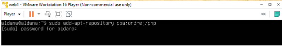

# Universidad Centroamericana José Simeón Cañas

`

# Ciclo 01/2023, Laboratorio:

### Catedrática: Elisa Aldana 
### 2023, Antiguo Cuscatlan 

¿Qué es el DNS? 
El Sistema de Nombres de Dominio o DNS es un sistema de nomenclatura jerárquico que se ocupa de la administración del espacio de nombres de dominio (Domain Name Space). Su labor primordial consiste en resolver las peticiones de asignación de nombres.

El proceso de solución de DNS supone convertir un nombre de servidor (como www.ejemplo.com) en una dirección IP compatible con el ordenador (como 192.168.1.1). Se da una dirección IP a cada dispositivo en Internet, y esa dirección será necesaria para encontrar el dispositivo apropiado de Internet, al igual que se usa la dirección de una calle para encontrar una casa concreta.

El sistema de nombres de dominio recurre a una red global de servidores DNS, que, a su vez, divide el espacio de nombres en zonas administradas de forma independiente las unas de las otras. Esto habilita la gestión descentralizada de la información de los dominios.

¿Qué es un servidor DNS?
 Un servidor DNS, también conocido como servidor de nombres, consiste en un software para servidores que recurre a la base de datos de un DNS para responder a las peticiones que guardan relación con el espacio de nombres de dominio. Como, por regla general, se alojan en hosts dedicados, también se denominan así a los ordenadores que albergan estos programas. Suele hacerse una diferenciación entre servidores DNS primarios y secundarios:
  1. Servidor primario, principal o maestro: se denomina a un servidor DNS primario o maestro cuando guarda la información sobre una zona determinada del espacio de nombres de dominio en su propia base de datos.
  2.  Servidor secundario o esclavo: cuando la información de un servidor de nombres no procede de los archivos de zona propios, sino que son de segunda o de tercera mano, este servidor se convierte en secundario o esclavo para esta información.

Esta situación se produce cuando un servidor no puede resolver una petición con su propia base de datos y ha de recurrir a la información disponible en otro servidor de nombres (resolución recursiva).

## creacion de la maquina virtual:

`

abrimos vm ware y damos click en crear nueva maquina virtual 

click en instaler disk image iso, y en browser buscamos nuestra imagen iso, alojada en el escritorio

dejamos el nombre por defecto

tamaño por defeccto(20GB)

lo siguiente es la informacion de nuestra maquina viertual, y damos click en finish

La máquina virtual se iniciará desde la imagen ISO que seleccionó y podrá comenzar la instalación del sistema operativo.

### configuración de la maquina virtual

seleccionamos idioma ingles

click en continue without updating

click en done, dejaremos el teclado en ingles

verificamos que solamente este marcado Ubuntu server

anotamos la ip que s enos muestra, la usaremos mas adelante 

dejamos en blanco el proxy addres

cambiamos SV por CO, esto debido a que utilizareemos el servidor de colombia

nos aseguramos que esten marcadas estas opciones

click en done

click en continue

Para fines prácticos del laboratorio, completamos el formulario con los siguientes datos:

    Name: uca
    server name: uca
    username: laboredes03
    password: 12345
 
 dejamos marcado skip for now
 
instalamos ssh

no marcamos ninguna de las opciones de la lista

comenzara la actualizacion, tomara unos minutos, pero solo daremos click cuando nos diga reboot now

## Servidor WEB 
Un servidor web (server) es un ordenador de gran potencia que se encarga de “prestar el servicio” de transmitir la información pedida por sus clientes (otros ordenadores, dispositivos móviles, impresoras, personas, etc.) 
Los servidores web (web server) son un componente de los servidores que tienen como principal función almacenar, en web hosting, todos los archivos propios de una página web (imágenes, textos, videos, etc.) y transmitirlos a los usuarios a través de los navegadores mediante el protocolo HTTP (Hipertext Transfer Protocol) y HTTPS

Tipos de servidores Web 
Servidor HTTP Apache El servidor HTTP Apache es un software de código abierto y gratuito, que durante años ha sido el software más utilizado por los servidores web, rivalizando actualmente con Nginx. 
Además destaca por ser multiplataforma, siendo compatible con sistemas operativos como Linux, Window, IOS, Unix, etc. Servidor Nginx Al igual que con Apache estaríamos ante un software de código abierto y multiplataforma compatible con Window, IOS, Linux, etc. Tiene una versión de pago además de la gratuita. Este tipo de servidor web es conocido por su buen funcionamiento cuando tiene que gestionar un número alto de visitas simultáneas, ya que los usuarios no perciben retraso en la carga de la página aunque se esté produciendo ese acceso concurrente.

Actualmente es el software para servidores web más usado en el mundo.
**LiteSpeed**
LiteSpeed nació como sustituto de Apache, para mejorar el rendimiento del servidor web en
entornos de alto tráfico.
Tiene una versión gratuita y otra de pago al igual que Nginx.
LiteSpeed puede ser utilizado como reemplazo directo de Apache, ya que ofrece compatibilidad
con los archivos .htaccess y las aplicaciones web diseñadas para Apache.
En la actualidad los tests de rendimiento no señalan una mejora al respecto de Nginx.
**Servidor Microsoft IIS**
Este tipo de servidor web está desarrollado por Microsoft y, en el caso de que se necesite
integrar herramientas de Microsoft, sería una alternativa recomendable por la compatibilidad
que obtendríamos.
Se ejecuta con Windows gracias a la tecnología IIS (Internet Information Services) y es
compatible con páginas programadas en ASP (Active Server Pages) o .NET, a diferencia del
resto de servidores web compatibles con Linux.
**Sun Java System Web Server**
Este tipo de servidor está pensado para programadores que trabajan con Java, Python o Ruby.
Es un servidor web creado para soportar una gran carga de trabajo con tecnologías muy
específicas como Java.
Si no se dispone de conocimientos avanzados en administración de sistemas no sería una opción
recomendada.

## Configuración de un Servidor Web
Se trabajara con apache, Mariadb y php
Creación de la máquina virtual con la versión de Ubuntu 22.04
1- Creación de la máquina virtual con la versión de Ubuntu 22.04

2- Instalamos el siguiente repositorio

3- Actualizamos toda la distribución. Con sudo apt update

4- Instalaremos los paquetes para trabajar con apache, mariadb y php

5- Después revisaremos el estado de apache y de mariadb con el siguiente comando

6- Mostrará la siguiente pantalla

7- En el firewall permitiremos las conexiones al protocolo http y https

8- Para trabajar con php modificaremos el archivo php.ini, en el cual habilitaremos las opciones de mostrar errores, de la siguiente manera:

9- Dentro del archivo buscaremos las líneas que contengan
Display_errors = Off y display_startup_errors = Off y cambiaremos los Off por On.
Después guardaremos el archivo

10- Reiniciaremos el servicio de apache para que sean efectivos los cambios

11- Modificaremos también el archivo php.ini pero el se encuentra en la carpeta cli y haremos la misma modificación Display_errors = Off y display_startup_errors = Off y cambiaremos los Off por On.
Después guardaremos el archivo

12- Reiniciamos el servicio de apache

13- Instalación de mariadb, con sudo mysql y para salirse de la consola de mariadb solo se digita exit.

14- Para ver el funcionamiento vamos a crear un pequeño archivo en php, que nos dé información

15- A dicho archivo agregaremos esta única línea.

16- Instalaremos w3m

17- Digitemos las siguientes direcciones

18- Que mostrará lo siguientes datos de php

19- Y la siguiente dirección para ver los datos de apache

## ¿Qué es un Servidor FTP?
 Como ya mencionamos antes, el llamado servidor FTP es un software que corre en los servidores conectados a Internet (o bien a una red local LAN), y tiene como función primordial permitir que diferentes clientes FTP puedan conectarse a él, para luego descargar o subir información (archivos). 
 En una conexión FTP siempre interviene un servidor FTP, pues sin éste nunca podría accederse a los archivos para interactuar con ellos (descarga, subir o eliminación de los mismos). Un elemento necesario para que un servidor FTP funcione es estar bajo una red TCP / IP, la cual estará conectada al servidor VPS, Cloud o Dedicado.

¿Cuáles son los pros y los contras del FTP?
El FTP tiene algunos beneficios que es importante mencionar. Dado que ha estado en
funcionamiento durante mucho tiempo, la mayoría de la gente ya está familiarizada con el
protocolo, y hay muchas herramientas de escritorio, incluidos FileZilla, WinSCP, Cyberduck y más,
que hacen que sea razonablemente sencillo emplear FTP. También es importante señalar que el FTP
tiene algunas características útiles, como la posibilidad de transferir varios archivos al mismo
tiempo, la posibilidad de reanudar una transferencia si se pierde la conexión y la posibilidad de
programar las transferencias.
Sin embargo, hay una desventaja significativa asociada con el FTP: la falta de seguridad. El FTP
fue inventado en los años setenta y como tal, es anterior a muchas de las medidas de seguridad
cibernética en las que hemos llegado a confiar en el mundo moderno. No se lo diseñó para ser un
protocolo seguro y las transferencias FTP no están cifradas, lo que significa que tus contraseñas,
nombres de usuario y otros datos confidenciales pueden ser leídos con relativa facilidad por los
piratas informáticos que capturan tus paquetes de datos (es decir, a través de un ataque de captura
de paquetes).
Debido a estos agujeros de seguridad, el soporte para FTP viene disminuyendo y han llegado al
mercado una variedad de diferentes opciones de reemplazo, incluidas SFTP, HTTPS, AS2 y FTPS.
A partir de 2020, Google Chrome desactiva el FTP de forma predeterminada y Firefox lo eliminó
de su código. 

### Configuración Servidor FTP

1. Primeramente, se debe instalar el paquete vsftp con el comando “sudo apt-get install
vsftpd.”

2. verificar que este corriendo el servicio de vsftp con el comando “systemctl status vsftpd”

3. seguidamente abrir los puertos con el comando “sudo ufw allow 21/tcp”, “sudo ufw allow
20/tcp”, “sudo ufw allow 22/tcp”, “sudo ufw allow 990/tcp”, “sudo ufw allow 40000:50000/tcp”
y seguidamente ejecutar “sudo ufw status” “sudo ufw enable”

4. seguidamente agregar un usuario con el comando “sudo adduser uca” (puede tener cualquier nombre)

5. Seguidamente agregar los servicios de root a ese usuario con el siguiente comando “sudo chown
root:root /home/uca” (en caso que no se llame uca su usuario poner el nombre que le asignaron )

6. crear una carpeta que servirá como directorio remoto para poder acceder al ftp y darle los permisos de root con los siguientes comandos

7. Acceder con un editor de texto a la carpeta “/bin/ftponly” y agregar “* : /bin/sh”

8.Acceder con un editor de texto a la carpeta “/etc/shells” y agregar “/bin/ftponly”

9. Seguidamente asignarle al usuario el archivo de configuración que editamos anteriormente con el comando “sudo usermod uca -s /bin/ftponly” (si el nombre de su usuario es diferente colocar el que le asigno ejemplo: sudo usermod nombre asignado -s /bin/ftponly)

10. con un editor de texto abrimos el archivo “/etc/vsftpd.conf” y des comentar las líneas 31,35,122 y agregar en la última línea lo siguiente: “allow_writeable_chroot=YES”

11. Ejecutar los siguientes comandos: “chmod 777 /home/uca” “chmod 777
/home/nombre de usuario de la maquina creada”

12.reiniciar los servicios de vsftp con el comando” sudo systemctl restart vsftpd” y verificar la ip de la maquina con el comando “ifconfig”

13. comprobar que la configuración esta correcta con la aplicación FileZilla introduciendo la dirección ip de su máquina virtual, nombre de usuario, su contraseña y probar puerto 22

14. mandar cualquier archivo de texto a nuestro servidor ftp es decir un archivo cualquiera de Windows a nuestra maquina virtual y acceder a la ruta en donde se mandó el doc.

## Servidor Proxy

Un servidor proxy funciona como un intermediario entre un ordenador e internet. De esta
manera, la información de nuestra computadora llega al servidor y la solicitud sale
directamente de este al lugar de destino bloqueando la comunicación directa entre nuestro
dispositivo y el de destino. Esto tiene distintas utilidades según el tipo de proxy que
utilicemos.
Algunos tipos de servidores proxy
● Proxy web
Su principal uso es la conexión a internet ocultando nuestra IP, esto nos aporta un nivel de
privacidad y además nos permite acceder a sitios que puedan estar bloqueados en el país
desde el que realizamos la petición.
● Proxy inverso
Su función es ser un equilibrador de carga para servidores web. Cuando se realizan muchas
peticiones a un servidor web este se puede saturar generando un ataque DDoS (denegación de
servicio distribuida), el proxy recibe todo el tráfico y lo distribuye equilibradamente entre los
servidores web evitando el ataque. Se le llama “inverso” ya que protege al servidor de destino
en lugar del cliente.
● Proxy caché
Este sirve para almacenar el contenido al que accedemos en sitios web (como texto e
imágenes), de modo que si volvemos a visitar el sitio y el servidor encuentra que la web no
ha cambiado, muestra el contenido almacenado en el caché mejorando el tiempo de carga y
reduciendo el tráfico.
Ventajas y desventajas
Por un lado hemos visto que los servidores proxy dificultan el rastreo de nuestra red, nos
permite acceder a contenido bloqueado por empresas o entidades gubernamentales, mejora la
velocidad de navegación y ayuda ahorro de ancho de banda, e incluso permite establecer
reglas dentro de una red familiar o empresarial para bloquear el acceso de los usuarios a
algunos sitios web.
Por otro lado, utilizar un proxy implica agregar un intermediario más entre el cliente y la
información que desea obtener, lo cual puede ralentizar la conexión. Además, si estamos
utilizando un proxy gratuito corremos el riesgo de que contenga un malware, que no cifre
nuestra información e incluso que rastree nuestra actividad y la venda a terceros.

### Configuración de un servidor proxy

Para esta práctica utilizaremos Squid, un proxy web-caché gratuito ampliamente utilizado
debido a su alta seguridad y gran cantidad de funciones.
1. Iniciamos instalando squid con sudo apt install squid -y.

2. Comprobamos que squid se encuentra activo con systemctl status squid.

3. Abrimos el puerto de squid en nuestro firewall con sudo ufw allow squid. Este puerto es el 3128, lo podemos encontrar en el archivo de configuración.

4. Utilizamos sudo nano /etc/squid/sites403.acl para crear un archivo en el que ingresaremos
los sitios web que queremos que el proxy prohiba. La extensión acl significa lista de control de acceso (Access-Control List).

5. Añadimos los sitios web que queremos prohibir con el siguiente formato
.<dominio.<extension

6. Accedemos al archivo de configuración de squid con sudo nano /etc/squid/squid.conf.

7. Al inicio del archivo añadimos las siguientes líneas:
acl sites403 dstdomain “/etc/squid/sites403.acl”
http_access deny sites403
Con esto le estamos indicando a squid que debe bloquear el acceso http a los sitios que se encuentran en el archivo que creamos.

8. Reiniciamos el servicio con systemctl restart squid y nos pedirá ingresar nuestra contraseña.

9. Ahora podemos intentar acceder a uno de los sitios web que bloqueamos con
curl -x http://localhost:3128 -I <sitio web
La opción -x indica que utilizaremos un proxy, -I se utiliza para devolver únicamente los
headers de la página. Aquí está una lista con todas las opciones que puede recibir el comando
curl.
Se nos muestra un error 403 que deniega el acceso.
Ahora vamos a asegurar el servidor añadiendo credenciales para ingresar a los sitios web.

10. Realizamos sudo apt install apache2-utils.

11. Ejecutamos sudo htpasswd -c /etc/squid/passwords <usuario> y nos pedirá crear una
contraseña la cual encriptará y guardará en el archivo de la ruta junto al usuario. No debemos
olvidar las credenciales ya que las utilizaremos más adelante.

12. Podemos ejecutar sudo cat /etc/squid/passwords para leer el archivo.

13. Volvemos al archivo de configuración con sudo nano /etc/squid/squid.conf y con Ctrl+W
buscaremos “INSERT” para localizar el siguiente apartado y añadiremos las siguientes líneas
como lo muestra la imagen:
auth_param basic program /usr/lib/squid/basic_ncsa_auth /etc/squid/passwords
auth_param basic realm Squid Basic Authentication
acl auth_user proxy_auth REQUIRED
http_access allow auth_user
http_access allow localnet

14. Volvemos a reiniciar el servicio con systemctl restart squid.

15. Intentamos acceder a un sitio web con curl -x http://localhost:3128 -I <sitio web>
(opcionalmente podemos sustituir localhost por la ip de nuestra máquina como se muestra en
la imagen). Vemos que retorna un error 407 que indica que se necesita autenticación de
proxy.

16. Volvemos a ejecutar el comando agregando nuestro usuario y contraseña de squid antes de la
ip de la siguiente manera:
curl -x http://<usuario>:<contraseña>@<localhost o ip>:3128 -I <sitio web>
Vemos que ahora nos devuelve un código 200 lo que significa que la solicitud ha sido
aceptada
NOTA: Es importante agregar el www en el sitio web, de lo contrario devolverá un error.

